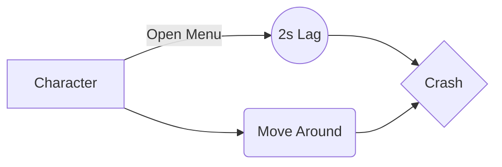

We provide a range of tools to make bug reporting as effective and informative as possible:

- **Basic Markdown**: Usable in comments and bug descriptions, you can use Mardown for easy formatting and readability. Check thix [cheat sheet](https://www.markdownguide.org/cheat-sheet/) for extra information.

- **Media support**: Instead of managing medias through the website, we encourage users to use dedicated websites: you could use [Youtube](https://youtu.be) for videos, [Imgur](https://imgur.com/) for images, or even clip a bug when you spectate on [Twitch](https://www.twitch.tv/). Every bug entry has a "Link" section for these info.

- **Math formula**: You can use math formula in your Markdown text thanks to [Katex](https://katex.org/). If you need math to make your point, surround your text with a $ sign!

$f(x) =\int_{-\infty}^{\infty}f(\hat\xi)e^{2 \pi i \xi x} d\xi$

- **Diagrams**: The Markdown processor supports [Mermaid](https://mermaid.js.org). Use diagrams to explain your issue in details.

